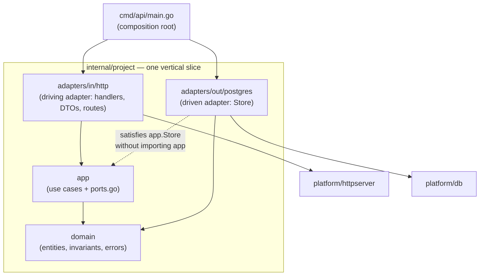

# taskservice

> A sample Go microservice that manages **projects** and **tasks**, built to show how a production-shaped service is put together: vertical (feature-based) slices, hexagonal layering inside each slice, dependency injection through Go's implicit interfaces, PostgreSQL with versioned migrations, a transactional outbox, graceful shutdown, and a one-command dockerized environment.


---

## Table of contents

1. [What this project demonstrates](#what-this-project-demonstrates)
2. [Quick start](#quick-start)
3. [Architecture at a glance](#architecture-at-a-glance)
4. [Repository layout](#repository-layout)
5. [Folder by folder](#folder-by-folder)
6. [Dependency injection with implicit interfaces](#dependency-injection-with-implicit-interfaces)
7. [Hexagonal vocabulary: Java ↔ Go](#hexagonal-vocabulary-java--go)
8. [Request lifecycle](#request-lifecycle)
9. [Domain rules](#domain-rules)
10. [Errors → HTTP status](#errors--http-status)
11. [Database and migrations](#database-and-migrations)
12. [Docker and Compose](#docker-and-compose)
13. [Configuration](#configuration)
14. [HTTP API](#http-api)
15. [Testing](#testing)
16. [Observability and operations](#observability-and-operations)
17. [Design decisions (and the alternatives we rejected)](#design-decisions-and-the-alternatives-we-rejected)
18. [Rules of the road](#rules-of-the-road)
19. [Extending the service](#extending-the-service)
20. [References](#references)

---

## What this project demonstrates

| Concern | How it shows up here |
|---|---|
| **Vertical slices** | `internal/project`, `internal/task`, `internal/outbox`: each feature owns its domain, use cases, HTTP handlers and Postgres code. Opening one folder is enough to understand and change one feature. |
| **Hexagonal layering inside a slice** | `domain/` → `app/` → `adapters/in/http` and `adapters/out/postgres`. Dependencies point inward; the compiler enforces it because every layer is its own Go package. |
| **Dependency injection, Go style** | No container, no annotations. The consumer (`app`) declares the interfaces it needs; adapters satisfy them implicitly; `cmd/api/main.go` wires concrete types once. |
| **Real business invariants** | Task status transitions, "cannot archive a project with open tasks", optimistic concurrency via `version`, idempotent task creation. Enough logic that the layering earns its keep. |
| **Transactional outbox** | Domain events are written in the same transaction as the aggregate and relayed asynchronously. No lost or phantom events. |
| **Operational hygiene** | `SIGTERM`-aware graceful shutdown, liveness/readiness endpoints, structured JSON logs with request IDs, OpenTelemetry hooks, linter-enforced package boundaries. |
| **One-command environment** | `make up` brings up Postgres → runs migrations → starts the API, with health-gated ordering in Docker Compose. |

---

## Quick start

**Prerequisites:** Docker with Compose v2, `make`. Go 1.24+ only if you want to run the API outside Docker.

```bash
git clone https://github.com/example/taskservice.git
cd taskservice
cp deployments/compose/.env.example deployments/compose/.env

make up            # postgres → migrate → api, in that order, health-gated
curl -s localhost:8080/healthz
```

A first round trip:

```bash
# create a project
curl -s -X POST localhost:8080/projects \
  -H 'Content-Type: application/json' \
  -d '{"name":"Website relaunch"}'

# create a task in it (idempotent: retry with the same key, get the same task)
curl -s -X POST localhost:8080/projects/<project-id>/tasks \
  -H 'Content-Type: application/json' \
  -H 'Idempotency-Key: 6f1c2d0e-1' \
  -d '{"title":"Write the brief","priority":2}'

# move it forward
curl -s -X POST localhost:8080/tasks/<task-id>/status \
  -H 'Content-Type: application/json' \
  -d '{"status":"in_progress","version":1}'
```

Everyday targets:

| Target | What it does |
|---|---|
| `make up` | Full stack in Docker (`postgres` → `migrate` → `api`) |
| `make down` | Stop and remove containers, keep the data volume |
| `make nuke` | `down` plus delete the Postgres volume |
| `make db` | Only Postgres + migrations, for running the API locally with `make run` |
| `make run` | `go run ./cmd/api` against the local Postgres |
| `make migrate` / `make migrate-down` | Apply / roll back migrations with `golang-migrate` |
| `make migrate-new name=add_labels` | Create a timestamped `up`/`down` pair in `migrations/` |
| `make test` | Unit tests (domain, app, handlers) — no database needed |
| `make test-integration` | Postgres adapter tests via testcontainers (`-tags integration`) |
| `make lint` | `golangci-lint`, including the dependency-boundary rules |
| `make build` | Static binary in `bin/api` |

---

## Architecture at a glance

Two separate questions get two separate answers:

* **How do we organize features?** → Vertical slices. Everything about *projects* lives in `internal/project`; everything about *tasks* lives in `internal/task`. Slices never reach into each other's adapters.
* **How do dependencies flow?** → Hexagonal (ports and adapters). Inside a slice, the domain knows nothing; the application layer knows the domain and declares what it needs from the outside world as interfaces (ports); adapters plug into those ports from the outside.



Key property: **`adapters/out/postgres` never imports `app`**. It only imports `domain` for the types it stores. It still satisfies `app.Store`, because in Go an interface is satisfied by having the right method set. That single fact is what makes dependency inversion automatic instead of something you impose.

In Go, the "bottom" of the runtime call stack (Postgres) is the "top" of the import graph (it imports the domain, the domain imports nothing). Walking from data to API, you walk backwards along the import arrows. That inversion is the whole point.

---

## Repository layout

```text
taskservice/                               ← repo root = Go module root = the service
├── go.mod
├── go.sum
├── Dockerfile                             ← multistage build of ./cmd/api; lives at root because the build context needs go.mod, cmd/, internal/
├── .dockerignore                          ← keeps .git, deployments/, docs and tests out of the image context
├── .gitignore                             ← deployments/compose/.env, bin/
├── .golangci.yml                          ← lint + depguard rules that enforce the layer boundaries
├── Makefile                               ← up, down, db, run, migrate, test, lint, build
├── README.md
│
├── cmd/
│   └── api/
│       └── main.go                        ← composition root: config, signals, wiring of every slice, HTTP server, outbox relay
│
├── internal/
│   ├── project/                           ══ feature slice: project ══
│   │   ├── domain/                        package domain  — Project, Status, invariants, errors. stdlib only.
│   │   │   ├── project.go
│   │   │   ├── errors.go
│   │   │   └── project_test.go
│   │   ├── app/                           package app     — use cases + the ports they need
│   │   │   ├── service.go                   Create, Get, Archive
│   │   │   ├── ports.go                     Store, TaskCounter, Transactor, EventWriter (interfaces)
│   │   │   └── service_test.go              fakes for every port, no database
│   │   └── adapters/
│   │       ├── in/
│   │       │   └── http/                  package http    — driving adapter: handlers, DTOs, routes, error → status
│   │       │       ├── handler.go
│   │       │       ├── dto.go
│   │       │       ├── routes.go
│   │       │       └── handler_test.go
│   │       └── out/
│   │           └── postgres/              package postgres — driven adapter: Store satisfying app.Store, never imports app
│   │               ├── store.go
│   │               ├── mapping.go
│   │               └── store_test.go        //go:build integration
│   │
│   ├── task/                              ══ feature slice: task ══ (same shape)
│   │   ├── domain/                          Task, Status + transition table, errors
│   │   ├── app/                             Create, Get, Update, List, ChangeStatus; ports: Store, ProjectReader, Transactor, EventWriter
│   │   └── adapters/
│   │       ├── in/http/
│   │       └── out/postgres/
│   │
│   ├── outbox/                            ══ feature slice: outbox ══ (used by project and task)
│   │   ├── domain/                          Event
│   │   ├── app/                             Relay use case; ports: Reader, Publisher
│   │   └── adapters/
│   │       ├── out/postgres/                Writer (same tx as the aggregate) + Reader
│   │       └── out/logpublisher/            sample Publisher; replace with kafka/, nats/ …
│   │
│   └── platform/                          cross-cutting code with zero business meaning
│       ├── config/                          env → typed Config
│       ├── db/                              pgx pool, health ping, Transactor, tx-in-context helper
│       ├── httpserver/                      server, middleware chain, JSON helpers, problem responses, /healthz /readyz
│       └── telemetry/                       slog setup, OpenTelemetry init/shutdown
│
├── migrations/                            ← ONE linear, timestamped history for the whole database
│   ├── 20260831120000_init.up.sql
│   ├── 20260831120000_init.down.sql
│   ├── 20260831120100_outbox.up.sql
│   └── 20260831120100_outbox.down.sql
│
├── api/
│   └── openapi.yaml                       ← the HTTP contract
│
└── deployments/
    ├── compose/                           ← local dev and CI
    │   ├── docker-compose.yaml              services: postgres → migrate → api
    │   ├── docker-compose.override.yaml     dev-only: publish 5432, debug log level
    │   ├── .env.example                     committed template (no secrets)
    │   ├── .env                             real values (gitignored)
    │   └── postgres/
    │       └── initdb/
    │           └── 00-extensions.sql        runs once on first boot; extensions/roles only, never tables
    └── k8s/                               ← later, if needed; same tree, different target
```

---

## Folder by folder

### Root files

| File | Purpose |
|---|---|
| `go.mod` / `go.sum` | Module definition. Because `go.mod` is at the root, **the root is the service**. `cmd/` and `internal/` sit next to it; there is no extra wrapper folder (that only earns its keep in a monorepo where each service has its own `go.mod`). |
| `Dockerfile` | Multistage build: a `golang` builder compiles a static binary (`CGO_ENABLED=0`), a `distroless/static` runtime image runs it as non-root. It lives at the root because the build context must contain `go.mod`, `cmd/` and `internal/`, and that's where CI systems and PaaS platforms look for it in a single-service repo. |
| `.dockerignore` | Keeps `.git`, `deployments/`, docs and test files out of the build context so image builds stay fast and reproducible. |
| `.golangci.yml` | Standard linters plus `depguard` rules such as "`domain/` may not import `database/sql`, `net/http` or `pgx`". The architecture is enforced by tooling, not by convention. |
| `Makefile` | The developer entry point. Every command in this README is a `make` target so nobody has to remember Compose flags or migrate CLI syntax. |

### `cmd/`

One directory per binary. `cmd/api/main.go` is the **composition root**: it is the only file in the repository that knows concrete types from every layer. It loads config, installs signal handling, opens the database pool, constructs each slice's adapters and services, registers routes, starts the outbox relay and the HTTP server, and shuts everything down in order on `SIGTERM`. It contains no business logic; if you find an `if` about tasks or projects in `main.go`, it is in the wrong place.

### `internal/<feature>/` — anatomy of a slice

`internal/` is enforced by the Go toolchain: nothing outside this module can import it. Each slice below it has the same four-part shape, so once you know one you know them all.

| Folder | Package | Responsibility | May import |
|---|---|---|---|
| `domain/` | `domain` | Entities (`Project`, `Task`), value types (`Status`), the rules that keep them valid (transition tables, length limits), and the error vocabulary (`ErrTaskNotFound`, `InvalidTransitionError`, …). No SQL, no JSON tags, no HTTP. | stdlib only |
| `app/` | `app` | Use cases (`Service.Create`, `Service.Archive`, …) and **ports**: the interfaces the use cases need from the outside world, declared in `ports.go`. This is the application layer of the hexagon. | `domain` |
| `adapters/in/http/` | `http` | The **driving** adapter. Decodes and validates DTOs, calls `*app.Service`, maps domain errors to status codes, encodes responses. Any business rule found here is misplaced. | `app`, `domain`, `platform/httpserver` |
| `adapters/out/postgres/` | `postgres` | The **driven** adapter. Implements the method set of `app.Store` (and any other outbound port) with real SQL, maps rows ↔ domain types, translates `pgx.ErrNoRows` into `domain.ErrProjectNotFound`. | `domain`, `platform/db` — **never `app`** |

`adapters/`, `in/` and `out/` contain no Go files; they are plain directories that make the layer and direction visible. The packages are `http` and `postgres`. When a slice only ever has one adapter per side, flattening to `adapters/http` and `adapters/postgres` is a reasonable simplification.

Package names repeat across slices (`domain`, `app`, `http`, `postgres`), so `main.go` aliases them by feature: `projectapp`, `projectpg`, `projecthttp`, `taskapp`, `taskpg`, `taskhttp`. Only the composition root pays that cost; nothing else imports across slices' adapters.

**Cross-slice needs.** When `project` needs something from `task` (the count of open tasks before archiving), `project/app` declares a two-method interface `TaskCounter`. It does not import the task slice. `main.go` hands it the task slice's Postgres store, which happens to have a `CountOpen` method. Same mechanism, one level up.

### `internal/outbox/`

A small slice that both `project` and `task` use. `adapters/out/postgres.Writer` appends an event row **inside the caller's transaction** (it reads the transaction from `context`), so "save the task" and "record `TaskCreated`" commit or roll back together. `app.Relay` polls unpublished rows (`FOR UPDATE SKIP LOCKED`, so several replicas can run it), hands each to a `Publisher` port, and marks it published. The sample ships a log publisher; a Kafka or NATS publisher is one more folder under `adapters/out/` and one line in `main.go`. Delivery is at-least-once, so consumers must de-duplicate on the event ID.

### `internal/platform/`

Everything that is shared and has **no business meaning**. If a file in here has an opinion about tasks or projects, it belongs in a slice instead.

| Folder | Contents |
|---|---|
| `config/` | Reads environment variables into a typed `Config` struct with defaults and validation. Fails fast at startup on a missing `DATABASE_URL`. |
| `db/` | Opens the `pgx` pool, exposes a health ping, and provides the `Transactor` (`WithinTx(ctx, fn)`) that stores a transaction in `context` so every adapter in the same use case joins the same transaction without passing `*pgx.Tx` around. Named `db` rather than `postgres` to avoid colliding with the slice adapters' package name. |
| `httpserver/` | The `net/http` server with timeouts, the middleware chain (request ID, recovery, structured request log, per-request timeout), JSON encode/decode helpers, the problem-response shape, and the `/healthz` and `/readyz` endpoints. |
| `telemetry/` | `slog` JSON handler setup and OpenTelemetry tracer/exporter initialization with a shutdown hook. |

### `migrations/`

One directory, one linear version sequence, because there is one database and the tables reference each other (`tasks.project_id → projects.id`). Per-slice migration folders would make ordering ambiguous. Files are timestamped (`20260831120000_init.up.sql`) rather than numbered so two branches cannot collide on `003`. Migrations are applied by a dedicated step (`make migrate`, or the `migrate` Compose service) and **never at API startup**; a service that migrates on boot makes every replica race to migrate on every deploy. See [Database and migrations](#database-and-migrations).

### `api/`

The OpenAPI document describing the HTTP contract. It is the source of truth for request/response shapes; handler tests assert against it. (This is what the name `api` means in Go repositories, which is why the application layer inside a slice is called `app`, not `api`.)

### `deployments/`

Everything about *running* the service, separated from everything about *writing* it. `compose/` is the local and CI environment (see [Docker and Compose](#docker-and-compose)); a `k8s/` or `helm/` sibling would hold production manifests and would reuse the same root `Dockerfile`. `.env.example` is committed and documents every variable; `.env` holds real values and is gitignored. `postgres/initdb/` is mounted to `/docker-entrypoint-initdb.d/`, which Postgres runs **once, on an empty volume**: it is for extensions and roles, never for tables, because it is not versioned.

